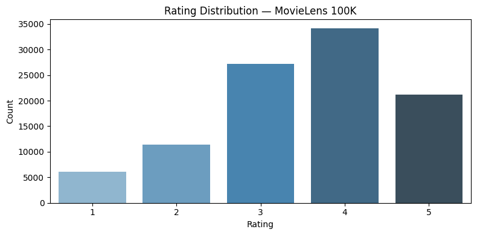
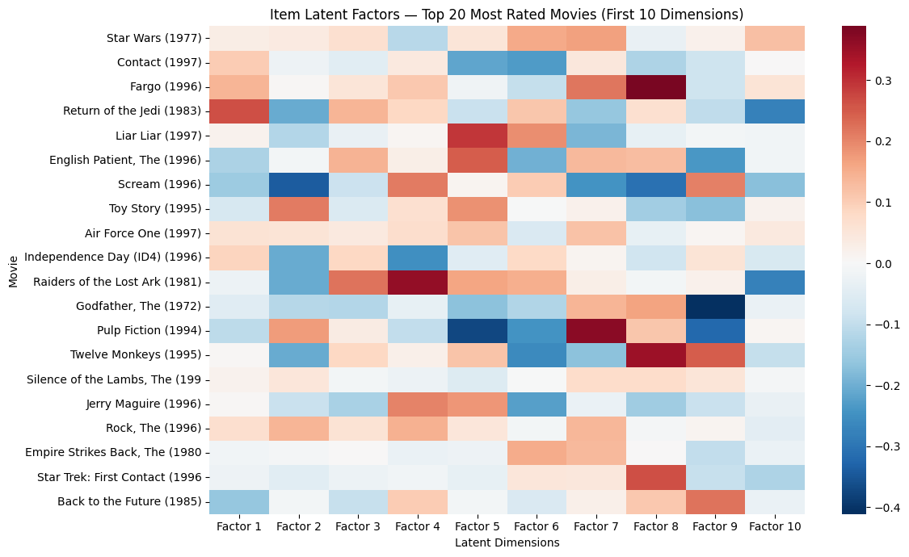
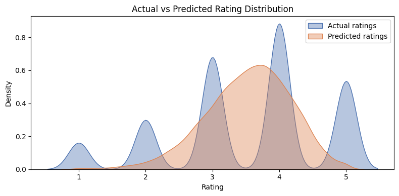

# Movie Recommendation System — SVD Matrix Factorization

Collaborative filtering recommendation engine built on MovieLens 100K using SVD matrix factorization.  
**Test RMSE: 0.9352 | Test MAE: 0.7375 | Zero overfitting across CV and test set**

---

## Overview

This project builds a recommendation system using Singular Value Decomposition (SVD)
matrix factorization on the MovieLens 100K dataset (100,000 ratings, 943 users, 1,682 movies).
The goal was to implement the same algorithmic family underlying Amazon's product recommendation
engine, with principled model selection, cross-validation, and latent factor interpretability analysis.

Built by Afrin Munshi — B.Tech (Hons.) Electrical Engineering, IIT Kharagpur.

---

## Results

| Model | RMSE (5-fold CV) | MAE (5-fold CV) | Variance |
|-------|-----------------|-----------------|----------|
| SVD | **0.9352 ± 0.0038** | **0.7370** | Low |
| NMF | 0.9665 ± 0.0064 | 0.7595 | High |

**Final test set (SVD):**

| Metric | Score |
|--------|-------|
| RMSE | **0.9352** |
| MAE | **0.7375** |
| Overfitting gap | 0.0000 |

Cross-validation and test RMSE are identical to 4 decimal places —
confirming the regularization configuration fully prevents overfitting on this sparse matrix.

---

## Dataset — MovieLens 100K

| Property | Value |
|----------|-------|
| Ratings | 100,000 |
| Users | 943 |
| Movies | 1,682 |
| Rating scale | 1–5 |
| Matrix sparsity | **93.70%** |
| Mean rating | 3.53 |

**Key EDA findings:**
- Distribution is negatively skewed — bulk of ratings cluster at 3–5, with ratings
1 and 2 forming a thin left tail. Reflects selection bias: users rate movies they
actively chose to watch.
- 93.7% sparsity is the core challenge — SVD addresses this by learning dense latent
representations that generalize across unobserved user-movie pairs.



---

## Model & Architecture

**Why SVD over NMF?**  
SVD decomposes the sparse user-item matrix R into two dense latent factor matrices
(U for users, V for items) of dimension k, such that R ≈ U × Vᵀ. Predicted ratings
are the dot product of a user's and item's latent vectors plus bias terms.

NMF applies the same decomposition with a non-negativity constraint, improving
interpretability but restricting the hypothesis space — confirmed empirically by
RMSE 0.9665 vs SVD's 0.9352 on this dataset.

### Hyperparameters

| Parameter | Value | Justification |
|-----------|-------|---------------|
| n_factors | 100 | Standard benchmark for MovieLens 100K; captures sufficient preference complexity |
| n_epochs | 20 | Convergence observed within 20 SGD passes on this dataset size |
| lr_all | 0.005 | Standard SGD learning rate range for matrix factorization (0.002–0.01) |
| reg_all | 0.02 | L2 regularization constraining latent vector magnitudes on 93.7% sparse data |

---

## Latent Factor Analysis

Item latent factors for the 20 most-rated movies visualized across the first
10 learned dimensions. Each dimension is an abstract preference axis discovered
purely from rating patterns — no explicit genre or feature labels provided.

Movies with similar row patterns appeal to similar user segments. Clusters of
warm and cool values across shared dimensions reveal implicit groupings likely
encoding genre, era, or production style.



---

## Predicted vs Actual Ratings



The predicted distribution is smoother and more centered than the actual
distribution — expected behavior for matrix factorization, which regresses
toward the mean for users and items with limited rating history (the cold-start effect).

---

---

## Setup & Reproduction

```bash
pip install scikit-surprise numpy pandas matplotlib seaborn
```

Open `movie_recommendation_svd.ipynb` in Google Colab (CPU runtime) and
run all cells top to bottom. Full training completes in under 3 minutes.

---

## What I Learned

1. **Sparsity is the defining challenge** — at 93.7% sparsity, naive approaches
like computing cosine similarity directly on the rating matrix fail. SVD's
latent factor approach sidesteps this by never operating on the raw sparse matrix.

2. **Model selection should be empirical, not assumed** — NMF is often described
as more interpretable and comparably accurate. On this dataset it was neither:
RMSE 0.9665 vs 0.9352, with higher variance. Cross-validation made this
difference visible before committing to a final model.

3. **Regularization is load-bearing on sparse data** — without reg_all=0.02,
users and movies with very few ratings overfit to their limited observations.
The zero gap between CV and test RMSE confirms the regularization worked correctly.

---

## References

- Koren et al. (2009). [Matrix Factorization Techniques for Recommender Systems](https://datajobs.com/data-science-repo/Recommender-Systems-[Netflix].pdf)
- Harper & Konstan (2015). [The MovieLens Datasets](https://dl.acm.org/doi/10.1145/2827872)
- Hug (2020). [Surprise: A Python library for recommender systems](http://jmlr.org/papers/v21/19-588.html)

---

*Built by Afrin Munshi — B.Tech (Hons.) Electrical Engineering, IIT Kharagpur*
